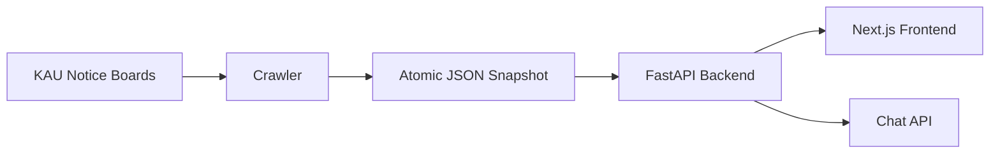

# KAU Notice Hub

한국항공대학교 곳곳에 흩어진 공지를 한곳에서 수집하고, 대상자별로 탐색하며, AI 챗봇으로 빠르게 찾아볼 수 있도록 만드는 공지 통합 플랫폼입니다.

## Overview

KAU 주요 게시판 **69개**를 단일 스키마로 수집해 약 2,300건 규모의 JSON 스냅샷을 유지하고, FastAPI 백엔드와 Next.js 프론트엔드, AI 챗봇으로 제공합니다. AWS Lightsail에 Docker Compose 기반으로 배포되며, 내장 크롤러 스케줄러가 3시간마다 atomic publish로 데이터를 갱신합니다.

## Project Map

| 영역         | 경로                                  | 설명                                                |
| ------------ | ------------------------------------- | --------------------------------------------------- |
| BackEnd      | [`BackEnd/`](../../BackEnd)           | FastAPI API 서버, 내장 크롤러 스케줄러, Docker 배포 |
| MVP          | [`MVP/`](../../MVP)                   | Next.js 14 프론트엔드 (백엔드 API 프록시 BFF)       |
| Crawler      | [`Crawler/`](../../Crawler)           | 독립 실행용 크롤러 패키지                           |
| Presentation | [`Presentation/`](../../Presentation) | 발표 자료 및 페이지별 구성 계획서                   |

## Architecture



## Tech Stack

- **Crawling**: Python, requests, BeautifulSoup, unhwp (HWP/HWPX 파싱)
- **Backend**: FastAPI, Pydantic, JSON 파일 스냅샷(atomic publish + mtime 캐시)
- **Frontend**: Next.js 14 App Router, TypeScript, Tailwind CSS
- **AI**: OpenAI Responses API (이미지/HWP content 보강), local fallback 챗봇
- **Infra**: Docker Compose, Caddy, AWS Lightsail, GitHub Actions 자동 배포

## Quick Start

```bash
# 1. BackEnd
cd BackEnd
python3 -m pip install -e '.[dev]'
uvicorn app.main:app --reload --port 8000

# 2. Frontend
cd MVP
yarn install && yarn dev
```

브라우저에서 `http://localhost:3000`으로 접속합니다. 자세한 실행/배포 방법은 각 모듈의 README를 참고하세요.

## Status

MVP가 AWS Lightsail에 실제 배포되어 운영 중입니다.

- 69개 공지 게시판 수집, 증분 크롤링으로 약 3분 30초에 갱신 (초기 전체 수집 대비 약 92% 단축)
- 대상자/중분류/세부 홈페이지 필터, 검색, 공지 챗봇 제공
- `main` 브랜치 push 시 GitHub Actions가 Lightsail에 자동 배포
- 챗봇은 현재 local fallback이며, RAG 도입은 [`BackEnd/docs/RAG_PLAN.md`](../../BackEnd/docs/RAG_PLAN.md) 단계 계획에 따라 진행 예정

## Documentation

- [BackEnd README](../../BackEnd/README.md) · [API Spec](../../BackEnd/docs/API_SPEC.md) · [Deployment](../../BackEnd/docs/DEPLOYMENT.md) · [RAG Plan](../../BackEnd/docs/RAG_PLAN.md)
- [MVP README](../../MVP/README.md) · [Classification](../../MVP/docs/CLASSIFICATION.md) · [Chatbot](../../MVP/docs/CHATBOT.md)
- [Crawler README](../../Crawler/README.md) · [Crawler Docs](../../BackEnd/docs/crawler/README.md)
- [Presentation Plan](../../Presentation/PRESENTATION_PLAN.md)

## Goals

분산된 학교 공지를 단순히 모으는 데서 그치지 않고, 사용자 질문과 운영 데이터를 기반으로 점진 개선되는 공지 지식 시스템을 지향합니다. 재학생·대학원생·교육원 수강생·취업 준비생 모두 자신에게 필요한 공지를 한곳에서 놓치지 않고 확인할 수 있도록 만드는 것이 목표입니다.
