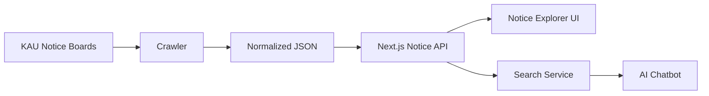

# KAU Notice Hub

한국항공대학교 곳곳에 흩어진 공지를 한곳에서 수집하고, 대상자별로 탐색하며, 필요한 공지를 AI 챗봇으로 빠르게 찾아볼 수 있도록 만드는 공지 통합 플랫폼입니다.

## What We Build

KAU Notice Hub는 공지 수집부터 탐색 UI, 검색, 챗봇 질의까지 하나의 흐름으로 연결합니다.

- **통합 크롤러**: 한국항공대학교 주요 공지 게시판을 단일 JSON 스키마로 수집
- **공지 탐색 MVP**: 대상자, 중분류, 세부 홈페이지, 검색어 기반 공지 탐색
- **공지 상세 열람**: 제목, 본문, 원문 링크, 첨부파일 확인
- **AI 챗봇**: 질문과 관련된 공지를 찾아 근거 기반 답변 제공
- **운영 친화 구조**: DB 없이 JSON 파일만으로도 실행 가능한 MVP 구조

## Project Map

| 영역         | 경로                        | 설명                                         |
| ------------ | --------------------------- | -------------------------------------------- |
| Crawler      | [`Crawler/`](../../Crawler) | 공지 게시판 수집, 파싱, 중복 제거, JSON 저장 |
| MVP          | [`MVP/`](../../MVP)         | Next.js 기반 공지 탐색 웹 앱과 챗봇 API      |
| Profile Docs | [`doc/profile/`](./)        | 조직/프로젝트 대표 소개 문서                 |

## Current Scope

현재 크롤러는 기본 설정 기준 **69개 게시판**을 수집합니다.

- 공식 홈페이지 공지
- 단과대, 학부, 학과, 전공 홈페이지 공지
- 대학일자리플러스센터, 산학협력단, 교수학습센터, 학술정보관 공지
- 대학원, 평생교육원, 비행교육원, 항공기술교육원 등 부속/전문기관 공지
- LMS, 입학처, 첨단분야 부트캠프사업단 등 보조 채널 공지

수집 데이터는 `title`, `content`, `published_at`, `original_url`, `attachments`, `source_name` 등을 포함하는 공통 포맷으로 정규화됩니다.

## Architecture



## Tech Stack

| 영역     | 기술                                        |
| -------- | ------------------------------------------- |
| Crawling | Python, requests, BeautifulSoup             |
| Frontend | Next.js 14, React, TypeScript, Tailwind CSS |
| API      | Next.js Route Handler                       |
| AI       | OpenAI API, local fallback                  |
| Storage  | JSON file storage                           |

## Quick Start

### 1. Crawl Notices

```bash
cd Crawler
pip install requests beautifulsoup4
python3 crawler/main.py
```

기본 산출물:

- `Crawler/output/kau_official_posts.json`
- `Crawler/output/kau_official_failed.json`
- `Crawler/output/crawler.log`

### 2. Run MVP

```bash
cd MVP
npm install
cp .env.example .env.local
npm run dev
```

브라우저에서 `http://localhost:3000`으로 접속합니다.

`.env.local` 예시:

```env
OPENAI_API_KEY=sk-...
OPENAI_MODEL=gpt-4.1-mini
NOTICE_JSON_PATH=kau_official_posts.json
```

`OPENAI_API_KEY`가 없으면 챗봇은 로컬 fallback 모드로 동작합니다.

## Main Features

### Crawler

- 게시판별 HTTP 클라이언트와 파서 분리
- 상시공지와 일반공지 수집 정책 분리
- 기존 결과 파일 기반 증분 수집
- URL 기준 중복 제거와 제목 정규화 기반 2차 중복 제거
- 실패 내역과 로그 파일 저장

### Notice MVP

- 대상자 대분류 기반 공지 탐색
- 중분류와 세부 홈페이지 필터
- 검색어 기반 공지 검색
- 공지 상세 페이지
- 검색 결과를 컨텍스트로 사용하는 챗봇
- URL 쿼리 파라미터 기반 상태 동기화

## Documentation

- [Crawler README](../../Crawler/README.md)
- [Crawler Docs Index](../../Crawler/docs/README.md)
- [Crawler Project Overview](../../Crawler/docs/01_project_overview.md)
- [Crawler Quickstart](../../Crawler/docs/02_quickstart.md)
- [Crawler Architecture](../../Crawler/docs/04_architecture.md)
- [MVP README](../../MVP/README.md)
- [MVP Classification](../../MVP/docs/CLASSIFICATION.md)
- [MVP Search](../../MVP/docs/SEARCH.md)
- [MVP Chatbot](../../MVP/docs/CHATBOT.md)
- [MVP Data Format](../../MVP/docs/DATA_FORMAT.md)

## Status

현재 프로젝트는 크롤러와 웹 MVP가 분리된 프로토타입 단계입니다.

- 크롤러는 다수의 KAU 공지 채널을 수집할 수 있습니다.
- MVP는 JSON 파일 기반으로 공지 탐색과 챗봇 질의를 제공합니다.
- 이후 단계에서는 DB 저장소, 벡터 기반 RAG, 오픈 소스 LLM, 콘텐츠 보강 파이프라인으로 확장할 계획입니다.

## Roadmap

앞으로는 단순 JSON 기반 MVP를 넘어 실제 운영 가능한 공지 지식 시스템으로 확장합니다.

- **Database Integration**: JSON 파일 저장소를 DB 기반 저장소로 전환해 검색, 갱신, 운영 안정성을 높입니다.
- **Vector-based RAG**: 공지 본문과 메타데이터를 임베딩해 벡터 검색 기반 RAG 구조를 구현합니다.
- **Open Source LLM Support**: GPT API에만 의존하지 않고, 오픈 소스 모델을 활용할 수 있는 추론 구조를 검토합니다.
- **Content Enrichment**: 본문이 없거나 이미지, 첨부파일 중심인 공지는 OCR, 파일 파싱, LLM 요약/정제 과정을 통해 검색 가능한 `content`를 생성합니다.
- **Scheduler & Automation**: 주기적 크롤링, 실패 재시도, 증분 업데이트, 로그 모니터링을 자동화합니다.
- **Search Quality Improvements**: 키워드 검색, 벡터 검색, 재랭킹을 결합해 질문과 실제 공지의 매칭 품질을 높입니다.
- **Deployment Readiness**: 운영 환경 배포, 환경변수 관리, 데이터 백업, 장애 대응 흐름을 정리합니다.

## Goals

KAU Notice Hub의 목표는 단순히 공지를 모으는 것이 아니라, 사용자별로 필요한 공지를 놓치지 않도록 만드는 것입니다.

- 재학생은 학사, 장학, 학과, 비교과 정보를 빠르게 확인할 수 있어야 합니다.
- 취업 준비생은 채용, 창업, 취업 지원 공지를 쉽게 찾을 수 있어야 합니다.
- 대학원생과 교육원 수강생은 자신에게 해당하는 별도 채널 공지를 한곳에서 확인할 수 있어야 합니다.
- 운영자는 새로운 게시판을 일관된 방식으로 추가하고 관리할 수 있어야 합니다.
